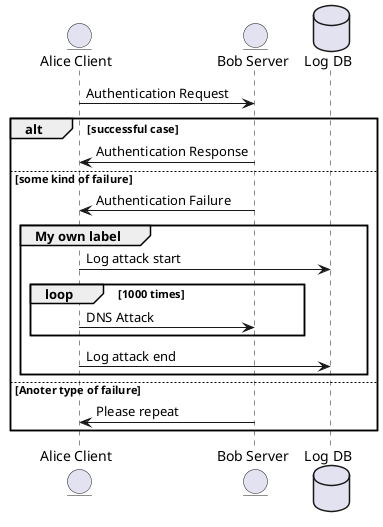

# 组合消息

## 关键词
- alt / else
- opt
- loop
- par
- break
- critical
- group

> 使用 `end` 用来结束分组

```plantuml
@startuml
entity Alice as "Alice Client"
entity Bob as "Bob Server"
database Log as "Log DB"

Alice -> Bob: Authentication Request

alt successful case
    Bob -> Alice: Authentication Response

else some kind of failure
    Bob -> Alice: Authentication Failure
    
    group My own label
        Alice -> Log: Log attack start
            loop 1000 times
                Alice -> Bob: DNS Attack
            end
        Alice -> Log: Log attack end
    end

else Anoter type of failure
    Bob -> Alice: Please repeat

end
@enduml
```