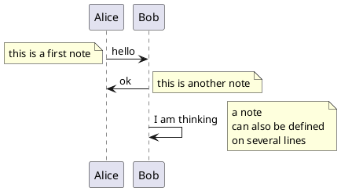

# 给消息添加注释
- 单行注释 `note left:`
- 单行注释 `note right:`
- 多行注释 `note left` / `note right`  和 `end note`成对使用

```plantuml
@startuml
Alice -> Bob: hello
note left: this is a first note

Bob -> Alice: ok
note right: this is another note

Bob -> Bob: I am thinking
note right
    a note
    can also be defined
    on several lines
end note

@enduml
```
