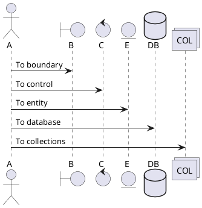

```plantuml
@startuml
actor A
boundary B
control C
entity E
database DB
collections COL

A -> B: To boundary
A -> C: To control
A -> E: To entity
A -> DB: To database
A -> COL: To collections
@enduml
```