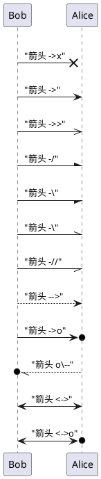

```plantuml
@startuml
Bob ->x Alice: \n "箭头 ->x"
Bob -> Alice: \n "箭头 ->"
Bob ->> Alice: \n "箭头 ->>"
Bob -\ Alice: \n "箭头 -/"
Bob -/ Alice: \n "箭头 -\"
Bob -\\ Alice: \n "箭头 -\\"
Bob -// Alice: \n "箭头 -//"
Bob --> Alice: \n "箭头 -->"
Bob ->o Alice: \n "箭头 ->o"
Bob o\\-- Alice: \n "箭头 o\\--"
Bob <-> Alice: \n "箭头 <->"
Bob <->o Alice: \n "箭头 <->o"
@enduml
```
