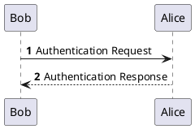
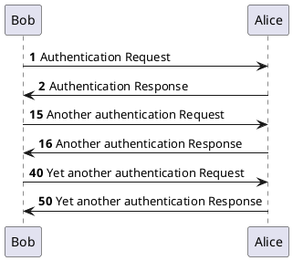
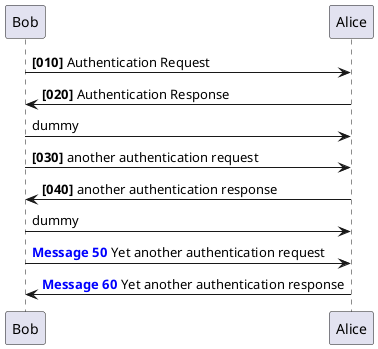

# 1.7对消息序列编号
## 语句 `autonumber <start>` 用于指定编号的初始值

```plantuml
@startuml
autonumber
Bob -> Alice: Authentication Request
Alice --> Bob: Authentication Response
@enduml
```

## `autonumber <start> <increment>` 可以同时指定编号的初始值和每次增加的值

```plantuml
@startuml

autonumber
Bob -> Alice: Authentication Request
Bob <- Alice: Authentication Response

autonumber 15
Bob -> Alice: Another authentication Request
Bob <- Alice: Another authentication Response

autonumber 40 10
Bob -> Alice: Yet another authentication Request
Bob <- Alice: Yet another authentication Response

@enduml
```

## 用语句 `autonumber stop` 和 `autonumber resume <increment> <format>` 来表示暂停或继续使用自动编号

```plantuml
@startuml

autonumber 10 10 "<b>[000]"
Bob -> Alice: Authentication Request
Bob <- Alice: Authentication Response

autonumber stop
Bob -> Alice: dummy

autonumber resume
Bob -> Alice: another authentication request
Bob <- Alice: another authentication response

autonumber stop
Bob -> Alice: dummy

autonumber resume "<b><font color=blue>Message 0"
Bob -> Alice: Yet another authentication request
Bob <- Alice: Yet another authentication response
@enduml
```