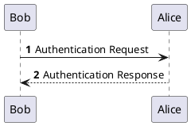
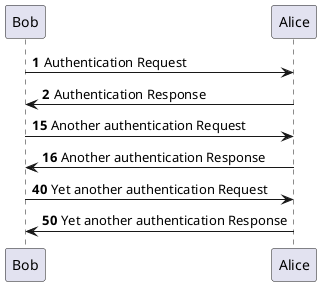

# 1.7对消息序列编号
## 语句 `autonumber start` 用于指定编号的初始值

```plantuml
@startuml
autonumber
Bob -> Alice: Authentication Request
Alice --> Bob: Authentication Response
@enduml
```

## `autonumber start increment` 可以同时指定编号的初始值和每次增加的值

```plantuml
@startuml

autonumber
Bob -> Alice: Authentication Request
Bob <- Alice: Authentication Response

autonumber 15
Bob -> Alice: Another authentication Request
Bob <- Alice: Another authentication Response

autonumber 40 10
Bob -> Alice: Yet another authentication Request
Bob <- Alice: Yet another authentication Response

@enduml
```