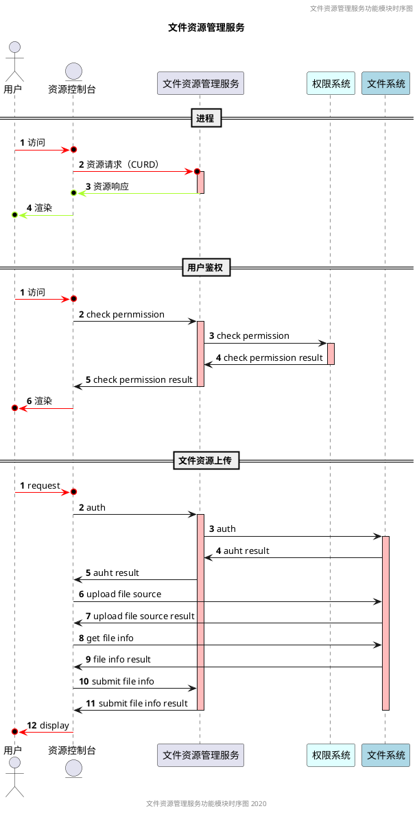
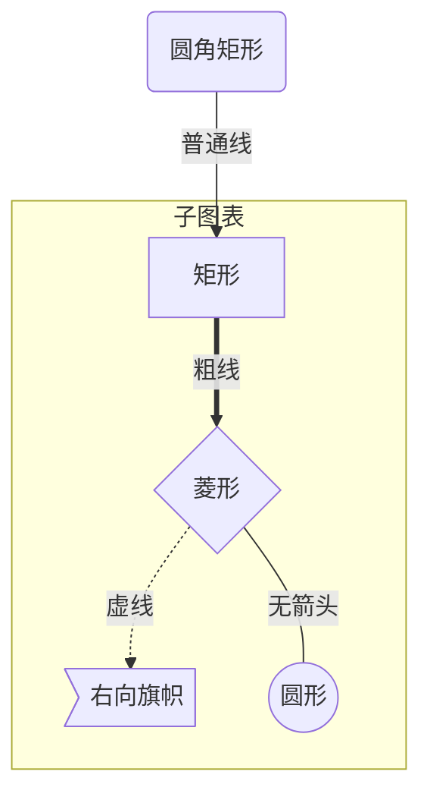

```plantuml
@startuml
title 文件资源管理服务
header 文件资源管理服务功能模块时序图
footer 文件资源管理服务功能模块时序图 2020  

actor 用户 
entity 资源控制台 
participant 文件资源管理服务 order 3
participant 权限系统 order 4 #LightCyan
participant 文件系统 order 5 #LightBlue

autonumber
== 进程 == 
用户 -[#red]>o 资源控制台 : 访问
资源控制台 -[#red]>o 文件资源管理服务 : 资源请求（CURD）
activate 文件资源管理服务 #FFBBBB
文件资源管理服务 -[#GreenYellow]>o 资源控制台 : 资源响应 
deactivate
资源控制台 -[#GreenYellow]>o 用户 : 渲染


||45|| 
autonumber 
== 用户鉴权 ==
用户 -[#red]>o 资源控制台 : 访问
资源控制台 -> 文件资源管理服务 : check pernmission
activate 文件资源管理服务 #FFBBBB
文件资源管理服务 -> 权限系统 : check permission
activate 权限系统 #FFBBBB
权限系统 -> 文件资源管理服务 : check permission result
deactivate
文件资源管理服务 -> 资源控制台 : check permission result
deactivate
资源控制台 -[#red]>o 用户 : 渲染


||45|| 
autonumber 
== 文件资源上传 ==
用户 -[#red]>o 资源控制台 : request
资源控制台 -> 文件资源管理服务 : auth
activate 文件资源管理服务 #FFBBBB
文件资源管理服务 -> 文件系统 : auth
activate 文件系统 #FFBBBB
文件系统 -> 文件资源管理服务 : auht result
文件资源管理服务 -> 资源控制台 : auht result
资源控制台 -> 文件系统 : upload file source
文件系统 -> 资源控制台 : upload file source result
资源控制台 -> 文件系统 : get file info
文件系统 -> 资源控制台 : file info result
资源控制台 -> 文件资源管理服务 : submit file info 
文件资源管理服务 -> 资源控制台 : submit file info result
deactivate
deactivate
资源控制台 -[#red]>o 用户 : display

@enduml
```

```mermaid
graph TB
    id1(圆角矩形)--普通线-->id2[矩形]
    subgraph 子图表
        id2==粗线==>id3{菱形}
        id3-.虚线.->id4>右向旗帜]
        id3--无箭头---id5((圆形))
    end
```
